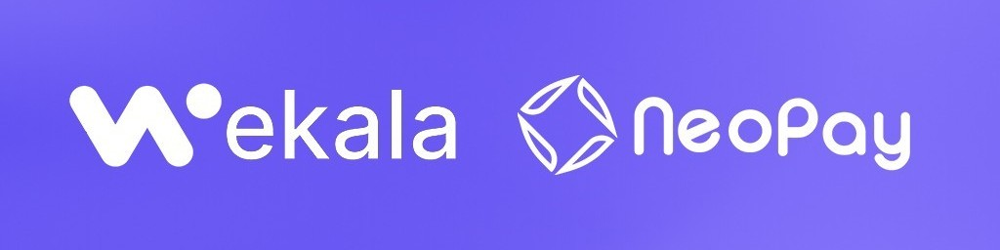

# Hola, mi nombre es Martin Herrera👋

### Desarrollador Web full-stack y Cofundador de Wekala Technologies S.A.S

Soy estudiante de ingenieria de sistemas, actualmente curso mi ultimo semestre en la universidad Simon Bolivar de Colombia.

Cuento con +2 años de experiencia como desarrollador web. Trayectoria en la creación de páginas y aplicaciones web de alto rendimiento que ofrecen a los clientes superar las necesidades del negocio. Mentalidad emprendedora y respaldada por mi experiencia como cofundador de Wekala Technologies S.A.S, una startup en etapa de crecimiento. Destacó en el trabajo colaborativo, aprendizaje constante y adopción de tecnologías emergentes. Además, cuento con capacidades empáticas y analíticas para enfrentar desafíos con una actitud proactiva, respaldado por una sólida formación en valores y principios.

## Encuéntrame en:

 

 

 
